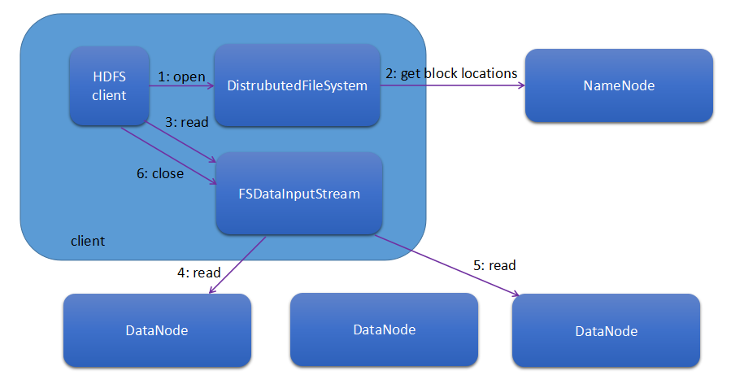
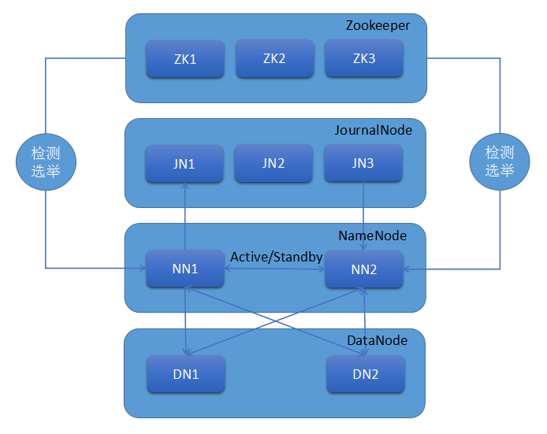

HDFS概念
========

1. 数据块  
  - 每个磁盘都有默认的数据块大小，这是磁盘进行数据读/写的最小单位。
  - 文件系统通过磁盘块来管理文件系统中的块。文件系统的块一般为几千字节，而磁盘块一般为512字节。
  - HDFS同样也有块的概念，默认为64MB。HDFS上的文件也被划分为块大小的多个分块（chunk），作为独立的存储单元。
  - 与其它文件系统不同的是，HDFS中小于一个块大小的文件不会占据整个块的空间。
  - 块抽象的好处：
    - 一个文件的大小可以大于网络中任意一个磁盘的容量。
    - 简化了存储子系统的设计。
  - 块非常适合用于数据备份而提高数据容错能力和可用性。
2. namenode和datanode  
  namenode管理文件系统的命名空间，它维护文件系统树和整棵树内所有的文件和目录。
  datanode是文件系统的工作节点，它们根据需要存储并检索数据块（受客户端或namenode调度），并且定期向namenode发送它们所存储的块的列表。
3. Hadoop文件系统  
  Hadoop有一个抽象的文件系统概念，HDFS只是其中的一个实现。
  Java抽象类org.apache.hadoop.fs.FileSystem定义了Hadoop中的一个文件系统接口。
4. 接口  
  Hadoop是用Java写的，通过Java API可以调用所有Hadoop文件系统中的交换操作。
  Hadoop还有以下接口：
  - thrift
  - C
  - FUSE
  - WebDav
5. 数据流  
  
6. Secondary NameNode  
  Secondary NameNode是Primary Namenode的助手，它负责周期性的对HDFS的元数据执行检查点（checkpoint）操作。目前的设计只允许在一个HDFS集群中存在一个Secondary Namenode。
  - 检查点的作用  
  fsimage文件和edits文件是Namenode节点上的核心文件。  
  Namenode中仅仅存储目录树信息，而关于Block的位置信息则是从各个Datanode上传到Namenode上的。  
  Namenode的目录树信息就是物理的存储在fsimage这个文件中的。当Namenode启动的时候会首先读取fsimage这个文件，将目录树信息装载到内存中。  
  而edits存储的是日志信息，在Namenode启动后所有对目录结构的增加、删除、修改等操作都会记录到edits文件中，并不会同步的记录在fsimage中。  
  而当Namenode节点关闭的时候，也不会将fsimage和edits文件进行合并，这个合并的过程实际上是发生在Namenode启动的过程中。  
  也就是说，当Namenode启动的时候，首先装载fsimage文件，然后再应用edits文件，最后还会将最新的目录树信息更新到新的fsimage文件中，然后启动新的edits文件。  
  缺陷是如果Namenode在启动后发生的改变过多，会导致edits文件变得非常大，大的程度与Namenode的更新频率有关系。那么在下一次Namenode启动的过程中，读取了fsimage文件后，会应用这个无比大的edits文件，导致启动时间变长，并且不可控。  
  Namenode的edits文件过大的问题，也就是Secondary Namenode要解决的主要问题。Secondary Namenode会按照一定的规则被唤醒，然后进行fsimage文件与edits文件的合并，防止edits文件过大，导致Namenode启动时间过长。
  - 检查点被唤醒的条件  
  控制检查点的参数有两个，分别是：
    - fs.checkpoint.period：单位秒，默认3600。检查点的间隔时间，当距离上次检查点执行超过该时间后启动检查点。
    - fs.checkpoint.size：单位字节，默认值67108864。当edits文件超过该大小后启动检查点。
  - 检查点的执行过程
    - 初始化检查点；
    - 通知Namenode启用新的edits文件；
    - 从Namenode下载fsimage和edits文件；
    - 调用loadFSImage装载fsimage；
    - 调用loadFSEdits应用edits日志；
    - 保存合并后的目录树信息到新的image文件中；
    - 将新产生的image上传到Namenode中，替换原来的image文件中；
    - 结束检查点。
  - SecondaryNameNode最好与NameNode部署到不同的服务器
  在merge的过程中Secondary Namenode对内存的需求与Namenode是相同的，所以对于大型的生产系统，如果将两者部署到相同服务器上，在内存上会出现瓶颈，所以最好将他们分别部署到不同的服务器上。  
  修改hdfs-site.xml中dfs.namenode.secondary.http-address的值可以改变Secondary Namenode的位置。
7. Quorum Journal Manager (QJM)  
    
  基本原理：用2N+1台JournalNode存储EditLog。每次写数据操作有大多数返回成功（>=N+1）时即认为该次写成功，数据不会丢失了。基于Paxos。
  - NN1、NN2（或更多个NN节点）只有一个是Active状态，通过自带ZKFailoverController组件和Zookeeper集群协同对所有NN节点进行检测和选举来达到此目的。
  - Active NN的Editlog写入共享的Journal Node集群中，Standby NN通过Journal Node集群获取Editlog，并在本地运行来保持和Active NN的元数据同步。
  - 如果不配做Zookeeper，可以手工切换Active NN/Standby NN；如果要配置Zookeeper自动切换，还需要提供切换方法，也就是要配置dfs.ha.fencing.methods参数。
